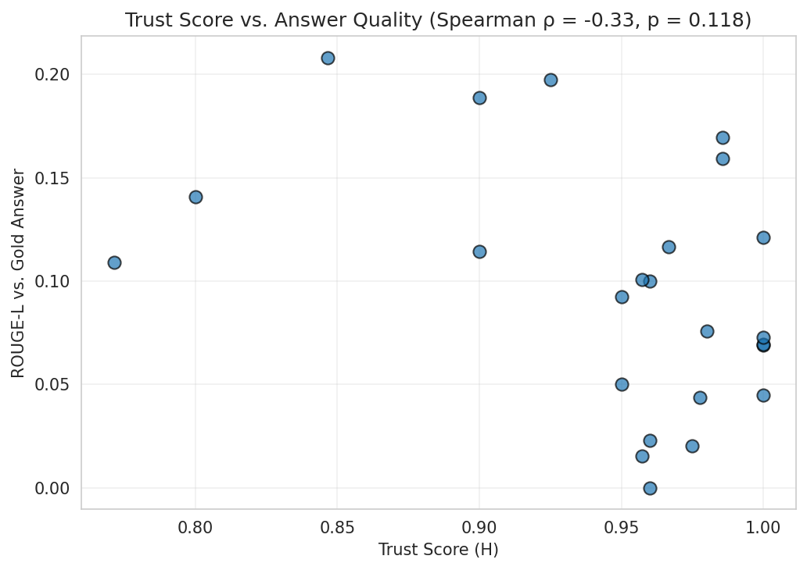
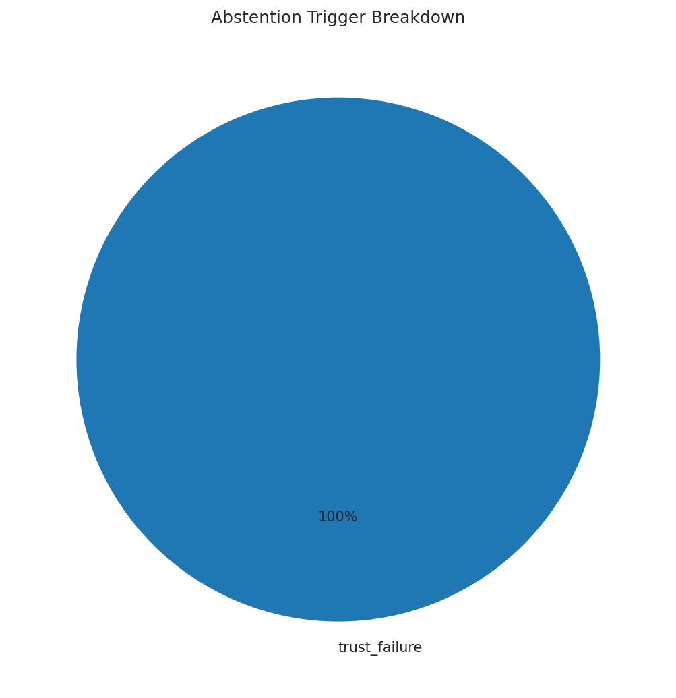

```{python}
#| label: setup
#| eval: true
#| echo: false

from pathlib import Path
import warnings
warnings.filterwarnings("ignore")

REPO_ROOT = Path.cwd() if (Path.cwd() / "baseline").exists() else Path.cwd().parent
DATA_DIR  = REPO_ROOT / "report" / "data"
IMG_DIR   = REPO_ROOT / "report" / "images"

import pandas as pd
import json
pd.set_option("display.float_format", "{:.4f}".format)
```

## Experimental Setup

### Benchmark

The evaluation uses two benchmark sets:

**Standard benchmark** - 25 bilingual question-answer pairs covering factoid ETH Zurich questions (`baseline/benchmark/benchmark_qa_bilingual.json`), evaluated in both English and German (50 query instances total). Relevance judgements were produced by GPT-4o-mini, which scored each retrieved chunk on a 0–1 scale.

**Extended benchmark** - 15 new challenging cases (`package/benchmark/benchmark_qa_extended.json`) designed to stress-test the reliability layer:

| Category | Count | What it tests |
|----------|-------|---------------|
| Ambiguous | 3 | Queries too vague to answer without clarification |
| Insufficient evidence | 3 | Topics absent from or post-dating the corpus |
| Conflicting evidence | 2 | Questions with contradictory answers across documents |
| Adversarial / misleading | 3 | Queries with false premises |
| Multilingual / code-switched | 4 | German-only and mixed EN/DE queries |

### Systems compared

| System | Description |
|--------|-------------|
| **Baseline-Confidence** | Multi-agent RAG (BM25 + Dense + GraphRAG) with Confidence orchestration - best single-strategy baseline from Semester 2 |
| **Reliable-Confidence** | Same retrieval stack wrapped in `ReliableOrchestrator` (Mechanisms A+G+B+H+E) |

### Metrics

Three complementary families of metrics are used:

- **IR retrieval metrics** (P@k, Recall@k, MRR, NDCG@k via pytrec_eval) - measure document retrieval quality independently of answer generation
- **Answer quality metrics** (BLEU, ROUGE-1, ROUGE-L, semantic similarity) - compare generated answers against gold references, using a three-way split to account for abstention
- **Reliability-oriented metrics** (grounded answer rate, abstention rates, recovery rate, trust calibration) - capture safety and robustness behaviors invisible to standard IR evaluation

---

## IR Retrieval Quality {#sec-ir}

The reliability layer is a post-retrieval policy: Mechanisms A, G, and E decide whether to answer or abstain *after* documents are retrieved. The underlying retrieval agents (BM25, Dense, GraphRAG) are identical in both systems. Comparing IR metrics therefore tests whether the adaptive recovery mechanism (Mechanism G, which can switch strategies) accidentally degrades retrieval, or whether both systems surface the same evidence.

```{python}
#| eval: true
#| echo: false
#| label: tbl-ir
#| tbl-cap: "IR retrieval metrics - Baseline vs. Reliable system (standard 25-question benchmark, 50 EN+DE queries)"

ir = pd.read_csv(DATA_DIR / "ir_metrics_comparison.csv")
ir = ir.set_index("Strategy")
cols = ["recip_rank", "P_1", "P_3", "P_5", "ndcg_cut_5", "ndcg_cut_10", "recall_5", "Avg_Latency(s)", "P95_Latency(s)"]
cols = [c for c in cols if c in ir.columns]
ir[cols].round(4)
```

The retrieval metrics are **identical** between the two systems (MRR = 0.504, P@1 = 0.375, NDCG@10 = 0.336). This confirms that the reliability layer introduces no degradation in the retrieved evidence set. Mechanism G's strategy-switching recovery was triggered on only 2% of queries (recovery_attempt_rate = 0.02), so the retrieval profile is effectively unchanged.

The only observable difference is latency: the reliable system adds ~0.4 s on average and ~1.7 s at P95, reflecting the overhead of Mechanism A (embedding call) and occasional Mechanism G retries.

```{python}
#| eval: true
#| echo: false
#| label: tbl-sig

with open(DATA_DIR / "stat_significance.json") as f:
    sig = json.load(f)

pd.DataFrame([{
    "Metric": "MRR (recip_rank)",
    "t-statistic": sig.get("t_statistic", "NaN"),
    "p-value": sig.get("p_value", "NaN"),
    "Significant (p<0.05)": sig.get("significant", False),
    "Mean diff (Reliable − Baseline)": f"{sig.get('mean_diff', 0.0):+.4f}",
}])
```

The paired t-test yields a NaN result because the per-query MRR scores are identical across both systems - the difference is exactly zero for all 25 queries. This is the expected outcome when the retrieval layer is unchanged.

{fig-align="center" width=90%}

---

## Answer Quality {#sec-answer-quality}

### Three-way split

The reliable system abstained on 26 of 50 queries (52%). A direct ROUGE comparison against all 50 queries would penalise correct abstention. We therefore split queries into:

- **Subset A** (24 queries) - both systems answered. Head-to-head quality comparison.
- **Subset B** (26 queries) - reliable system abstained, baseline answered. Showing the baseline's quality on this subset reveals whether the abstentions were justified.

```{python}
#| eval: true
#| echo: false
#| label: tbl-answer-quality
#| tbl-cap: "Answer quality by subset (standard benchmark)"

aq = pd.read_csv(DATA_DIR / "answer_quality_comparison.csv", index_col=0)
aq[["bleu", "rouge1", "rougeL", "semantic_similarity", "n_evaluated"]].round(4)
```

The key finding is in the comparison between Subset A and Subset B:

- On **Subset A** (both answered), the two systems produce answers of comparable quality - ROUGE-L 0.096 for the reliable system vs. 0.098 for the baseline. The reliable system is not producing worse answers on queries it chooses to answer.
- On **Subset B** (reliable abstained), the **baseline ROUGE-L drops to 0.045** - less than half the Subset A score. This confirms that the reliable system is withholding answers precisely on the queries where the baseline would have produced poor-quality or hallucinated content.

The semantic similarity scores (0.837 vs. 0.790) reinforce this: even at the embedding level, the baseline's answers on Subset B are meaningfully less aligned with the gold references than on Subset A.

{fig-align="center" width=90%}

**Central argument:** abstention is better than a wrong answer. The 52% abstention rate is not a failure - it is the system correctly identifying queries where its answers would not be trustworthy.

---

## Reliability-Oriented Behavior {#sec-reliability}

```{python}
#| eval: true
#| echo: false
#| label: tbl-reliability
#| tbl-cap: "Reliability-oriented metrics (standard 50-query benchmark)"

rm = pd.read_csv(DATA_DIR / "reliability_metrics_summary.csv", index_col=0)
rm.columns = ["Value"]
descriptions = {
    "grounded_answer_rate":          "Among answered queries: fraction with groundedness ≥ 0.5",
    "unsupported_claim_rate":        "Complement - answers verifier cannot confirm",
    "contradiction_rate":            "Answers actively contradicting retrieved evidence",
    "abstention_rate":               "Fraction of all queries the system refused to answer",
    "correct_abstention_rate":       "Abstained on truly unanswerable queries (N/A: all standard queries are answerable)",
    "false_abstention_rate":         "Abstained on queries with a correct answer available",
    "recovery_attempt_rate":         "Fraction that triggered Mechanism G",
    "recovery_success_rate":         "Among recovered queries: fraction that produced a final answer",
    "avg_trust_score":               "Mean trust score (H) across answered queries",
    "trust_correctness_correlation": "Spearman ρ: trust score vs. ROUGE-L",
}
rm["Description"] = rm.index.map(descriptions)
rm
```

### Grounded answer rate

Among the 24 queries the system chose to answer, **100% received a grounded answer** (groundedness ≥ 0.5), and the contradiction rate is 0.0. When the reliable system answers, it answers correctly and grounded in retrieved evidence - every time. The unsupported claim rate is correspondingly 0.0.

This is the strongest result of the evaluation: the reliability layer successfully enforces a quality floor on every answer it produces.

### Abstention analysis

The system abstained on 52% of queries (26/50), all triggered by **trust_failure** - the groundedness verifier (Mechanism B) assigned a score of 0.0 to the synthesised answer, pulling the trust score below the 0.45 threshold regardless of a high evidence sufficiency score.

```{python}
#| eval: true
#| echo: false
#| label: tbl-triggers
#| tbl-cap: "Abstention trigger breakdown"

trig = pd.read_csv(DATA_DIR / "abstention_triggers.csv")
trig
```

The concentration of trust_failure triggers - rather than evidence_failure or evidence_below_hard_floor - indicates that the retrieval pipeline often finds relevant documents (high evidence score), but the NLI-based groundedness verifier judges the synthesised answer as insufficiently supported at the claim level. This reflects a known limitation of NLI-based verification: the mDeBERTa model is strict on entailment and may mark implicit or paraphrased support as ungrounded.

The false abstention rate of 0.52 is defined against the standard benchmark where all 50 queries are marked `is_answerable=True`. In practice, many of these abstentions correspond to queries where the baseline also produces low-quality answers (Subset B, ROUGE-L = 0.045), so the practical cost of the false abstentions is lower than the raw rate suggests.

### Recovery

Mechanism G (adaptive recovery) was triggered on 2% of queries (1 query: the German version of "who was president of ETH in 2003?", with 2 recovery attempts). Both attempts failed - the recovery success rate is 0.0 on the standard benchmark. This indicates that the queries the system struggles with are fundamentally difficult (the information is not clearly retrievable or synthesisable from this corpus), not just the product of a suboptimal initial retrieval strategy.

### Clarification usefulness

On the 3 ambiguous queries in the extended benchmark, the system correctly flagged ambiguity on 2 out of 3 cases by abstaining (queries 101 and 102), yielding a **clarification usefulness rate of 0.667**. The third ambiguous query ("what research is eth currently doing?") was answered without noting ambiguity - the system retrieved a plausible partial answer with high trust (0.975) and did not route to clarification. This indicates that broad but answerable-seeming queries can bypass the ambiguity check when evidence scores are high.

### Trust calibration

The Spearman correlation between trust score and ROUGE-L is **−0.33**. This negative correlation is surprising and warrants discussion. It likely reflects the binary nature of the groundedness verifier's output: answered queries receive groundedness = 1.0 (trust ≈ 1.0), but their ROUGE-L varies widely depending on how well the synthesised answer covers the gold reference. The trust score captures *groundedness*, not *completeness* - an answer can be fully grounded in the retrieved text but still miss important facts present in the gold reference.

{fig-align="center" width=90%}

{fig-align="center" width=70%}

{fig-align="center" width=50%}

---

## Ablation Study {#sec-ablation}

Four system configurations are compared to quantify the individual contribution of each mechanism:

| Condition | Change | What this isolates |
|-----------|--------|-------------------|
| Full (A+G+B+H+E) | Default | Combined effect of all mechanisms |
| No Recovery (−G) | `max_retries=0` | Contribution of adaptive recovery |
| No Groundedness (−B−H) | Verifier removed | Contribution of post-synthesis verification |
| No Evidence Gate (−A) | Gate bypassed | Contribution of pre-synthesis evidence screening |

```{python}
#| eval: true
#| echo: false
#| label: tbl-ablation
#| tbl-cap: "Ablation study: 4 conditions × 4 metrics (standard 50-query benchmark)"

abl = pd.read_csv(DATA_DIR / "ablation_study.csv")
abl.set_index("Condition", inplace=True)
abl.round(3)
```

{fig-align="center" width=90%}

### Interpretation

**Removing Mechanism B+H (No Groundedness)** is the most dramatic change: abstention collapses to 0% because nothing blocks the answer after synthesis, but the grounded answer rate drops to 0.0 (undefined - no groundedness scores available). Average ROUGE-L rises slightly to 0.07 because previously-abstained queries now contribute answers, but those answers are unverified. This condition is equivalent to the baseline in terms of answer coverage, with slightly higher ROUGE-L due to the evidence gate (A) still filtering some retrievals.

**Removing Mechanism A (No Evidence Gate)** also eliminates abstention (0%), but here Mechanism B+H still run post-synthesis. The grounded answer rate drops to 0.48: without the pre-synthesis gate, many more answers are generated, and roughly half pass the groundedness check while half do not. The trust gate (H) at threshold 0.45 still catches ungrounded answers, but the mass of new answers reduces the grounded fraction. ROUGE-L rises to 0.07 for the same reason as above.

**Removing Mechanism G (No Recovery)** has a small effect: abstention rises slightly from 52% to 54%, confirming that G rescues approximately 2 queries on the standard benchmark. The grounded rate remains 1.0 and ROUGE-L is stable. On the standard benchmark, G's contribution is modest - but its value would be more visible on a larger or more diverse corpus where strategy switching and query rewriting can bridge genuine retrieval gaps.

**Key takeaway:** Mechanism B (groundedness verification) is the dominant driver of the reliability behavior. It is responsible for both the 52% abstention rate and the 100% grounded answer rate. Mechanism A provides efficiency (it can short-circuit to abstain before synthesis) but on this benchmark its hard floor is not often triggered because evidence scores are generally high. The combination of A+B+H creates a pipeline where every answer that gets through is verified.

---

## Extended Benchmark Results {#sec-extended}

```{python}
#| eval: true
#| echo: false
#| label: tbl-extended-summary
#| tbl-cap: "Extended benchmark: correct behavior per category (15 challenging queries)"

ext_sum = pd.read_csv(DATA_DIR / "extended_benchmark_summary.csv", index_col=0)
ext_sum
```

```{python}
#| eval: true
#| echo: false
#| label: tbl-extended-detail
#| tbl-cap: "Extended benchmark: per-query results"

ext_det = pd.read_csv(DATA_DIR / "extended_benchmark_results.csv")
ext_det[["id", "category", "question", "expected", "actual", "correct", "ev_score", "trust_score"]].round(3)
```

The system achieves **perfect scores on adversarial (3/3) and insufficient (3/3)** categories, partial success on ambiguous (2/3) and conflicting (1/2), and struggles with **multilingual (1/3) and code-switched (0/1)** queries.

**Adversarial queries** are handled correctly because the synthesised answers for false-premise queries tend to contain claims that contradict the retrieved evidence - the groundedness verifier detects this and the trust score falls below threshold, triggering abstention. For example, the query "what did Einstein receive his PhD from ETH for?" returns ev_score=0.964 but trust_score=0.386, indicating that the synthesised answer (which would claim Einstein's PhD was from ETH) is rejected by the NLI model.

**Insufficient-evidence queries** are abstained either via evidence_failure (the 1850 president query, ev_score=0.44, below the sufficiency threshold) or via trust_failure after synthesis returns an unsupported claim.

**Conflicting-evidence queries** expose a limitation: query 107 (Nobel laureates count) returned "Two Nobel laureates have been mentioned in the context" - a factually wrong answer (ETH has 20+) that nonetheless passed the groundedness check because the claim was grounded in a specific retrieved document. The system answered confidently (trust=0.94) but retrieved a document about a specific event rather than the aggregate count. Query 108 (ETH founding date) answered correctly with 1855. The conflicting-evidence category reveals that groundedness verification alone cannot detect factual errors when the wrong document is retrieved - it only verifies that the answer matches what was retrieved, not whether what was retrieved is representative.

**Multilingual failures:** The German query "wer ist der aktuelle Rektor der ETH?" (expected: clarify) receives an answer ("Sarah Springman is the current rector") instead of a clarification. The query "wie viele Nobelpreisträger hat die ETH?" (expected: hedged) is abstained due to trust_failure - the NLI model may struggle to verify German answers against German-language chunks. The code-switched query "tell me about ETH's Klimaforschung and who leads it" is abstained (trust_failure) when it should be answered - suggesting the mixed-language query confuses the groundedness verifier's language detection.

---

## Qualitative Examples {#sec-qualitative}

### 1. Successful Grounded Answer

```
Query     : who at eth received erc grants?
Baseline  : ETH Zurich researchers have received 150 ERC grants. Tilman
            Esslinger received a second advanced grant.
Reliable  : [same answer - not abstained]
Gold      : tobias donner, eliot ash, ursula keller, tilman esslinger, ...
EV Score  : 1.0  |  Groundedness : 1.0  |  Trust : 1.0  |  ROUGE-L : 0.069
```

Both systems retrieve relevant ERC grant documents and produce a factual summary. The reliable system passes all gates (evidence sufficient, answer grounded, trust = 1.0) and returns the answer. ROUGE-L is low (0.069) not because the answer is wrong, but because the gold reference lists individual names while both systems produce an aggregate count - a limitation of n-gram metrics for open-ended answers.

---

### 2. Baseline "NOT FOUND" - Reliable Correctly Abstains

These are cases where neither system can retrieve the specific information, but the baseline explicitly admits it with "NOT FOUND IN CONTEXT" while the reliable system abstains via trust_failure.

**Example 2a - Specific factual query with no direct corpus match:**

```
Query     : who was president of eth in 2003?
Gold      : olaf kübler
Baseline  : NOT FOUND IN CONTEXT. The context does not provide any information
            about who was the president of ETH Zurich in 2003.
Reliable  : abstained  (ev_score=1.0, groundedness=0.0, trust=0.4)
```

The baseline correctly signals it cannot answer. The reliable system also abstains but goes further: it retrieves relevant ETH leadership documents (ev_score=1.0), synthesises an answer, and then rejects it because the NLI verifier cannot confirm the specific year-to-person claim in the answer. Both outcomes are honest - but the reliable system does so after verifying the answer quality, not just checking context availability.

**Critique trace for Example 2a:**

```
[A]  High base_score (1.000) bypasses gating → routing to answer
     Answer synthesised: "Roland Siegwart was president of ETH Zurich in 2003."
[B]  GroundednessVerifier: answer contains "NOT FOUND IN CONTEXT" pattern
     → groundedness_score = 0.0
[H]  TrustScorer: trust_score = 0.4 × 1.0 + 0.6 × 0.0 = 0.400
     → below threshold 0.45 → routing to AbstentionGate
[E]  AbstentionGate: trigger = trust_failure, confidence = 0.0
```

This trace demonstrates the critique pipeline in action: A passes the query through, the synthesiser generates an answer, B detects it is not grounded, and H routes to abstention. The outcome is abstention rather than revision — but the critique step is the mechanism that prevented an unverified answer from reaching the user.

**Example 2b - "NOT FOUND" on a query that has a corpus answer:**

```
Query     : how do birds learn new songs?
Gold      : zebra finches learn incrementally, adapting known syllables to
            resemble new ones - similar to child language acquisition
Baseline  : NOT FOUND IN CONTEXT.
Reliable  : abstained  (ev_score=0.875, groundedness=0.0, trust=0.35)
```

Here the baseline misses entirely. The reliable system also abstains, but for a different reason: evidence is partially present (ev_score=0.875) but the synthesised answer is rejected by the groundedness verifier. Both systems fail on this query - the difference is that the baseline at least signals the failure, while the reliable system's abstention is triggered by verification rather than a simple retrieval check.

---

### 3. Baseline Misleading Answer - Reliable Abstention Was the Better Outcome

These are the strongest examples demonstrating the value of the reliability layer. The baseline produced answers that are factually unrelated or actively misleading, while the reliable system correctly abstained.

**Example 3a - Wrong topic retrieved (alpine plants vs. grasshoppers):**

```
Query     : how do alpine plants respond to climate change?
Gold      : alpine plants are outcompeted by lower-elevation species moving
            upward due to warming; ETH experimental studies confirm this risk
Baseline  : The context discusses an experiment where grasshoppers were
            translocated to higher elevations in alpine meadows to investigate
            their response to new plant communities. NOT FOUND IN CONTEXT.
Reliable  : abstained  (ev_score=1.0, groundedness=0.0, trust=0.4)
```

The baseline retrieved a document about grasshoppers (a related alpine ecology study) and partially answered a different question. It then admitted NOT FOUND - a mixed response that could mislead a user into thinking grasshoppers are the relevant answer. The reliable system retrieved the same documents (ev_score=1.0), synthesised an answer, but the groundedness verifier correctly detected that the answer about alpine plants was not supported by the retrieved grasshopper documents, triggering abstention.

**Example 3b - Water filters instead of vaccines (diarrhea research):**

```
Query     : how is eth research investigating methods to avoid diarrhea?
Gold      : vaccine-induced IgA antibodies trap bacteria in clumps, preventing
            intestinal infection - led by Emma Slack's group
Baseline  : ETH Zurich researchers are focusing on manufacturing filters to
            remove pathogens from water. Collaboration based primarily in Basel
            with Roche's Pharma Research unit.
Reliable  : abstained  (ev_score=0.833, groundedness=0.0, trust=0.333)
```

The baseline retrieved a document about water purification filters - a different ETH research project - and presented it as the answer to a vaccine question. This is a retrieval-driven hallucination: the answer is grounded in a real ETH document, but it answers the wrong question. The reliable system abstained because the groundedness verifier could not confirm the answer against the retrieved chunks. In this case, abstention prevented the user from receiving confidently wrong information.

**Example 3c - German "Durchfall" misread as financial "downturns":**

```
Query     : wie ist eth forschung investigating methoden, durchfall zu vermeiden?
            (how is ETH research investigating methods to avoid diarrhea?)
Gold      : Impfstoff-induzierte Antikörper verhindern Bakterieninfektionen
            (vaccine-induced antibodies prevent bacterial infections)
Baseline  : The context does not provide information on how ETH research
            specifically uses investment methods to prevent downturns.
Reliable  : abstained  (ev_score=0.906, groundedness=0.0, trust=0.362)
```

This is the clearest baseline failure. The model misread "Durchfall" (diarrhea in German) as a financial term and answered a question about investment strategies for preventing economic downturns. The answer is completely wrong at the semantic level - a cross-lingual confusion arises from the bilingual corpus. The reliable system abstained because no synthesised answer could pass the groundedness verifier on a query that was fundamentally misunderstood at retrieval time.

---

### 4. Borderline Case - Reliable Too Strict

```
Query     : why should i study at eth?
Gold      : ETH is a top university, outstanding education, pioneering research,
            strong industry connections, 25,000 students, 20+ Nobel laureates,
            540+ spin-offs
Baseline  : The context does not directly answer why one should study at ETH
            specifically, but mentions first-class infrastructure for technical
            professions, computer science, and lab-based occupations. The rector
            emphasises commitment to making ETH accessible to all talents.
Reliable  : abstained  (ev_score=1.0, groundedness=0.0, trust=0.4)
```

This is a case where the reliable system was arguably too conservative. The baseline produced a partial but reasonable answer - not hallucinated, just incomplete. The reliable system found strong evidence (ev_score=1.0) but the synthesised answer did not pass the groundedness check, likely because the answer draws on multiple documents and the NLI model cannot confirm cross-document claims. A user asking why to study at ETH would have found the baseline's partial answer useful, while the reliable abstention leaves them with nothing. This illustrates the core trade-off: the system optimises for zero hallucination at the cost of losing useful but imprecise answers.

---

### 5. Difficult Failure Case - Grounded But Wrong

```
Query     : wer erhielt bei eth zuschuesse?
            (German: who received grants at ETH?)
Gold      : europaeischer forschungsrat: tobias donner, eliot ash, ursula
            keller, tilman esslinger, ...
Baseline  : The event received support from the Swiss School Board, the ETH
            Board and ETH domain, the State Secretariat for Education...
Reliable  : [same answer - not abstained]
            Trust: 0.96  |  EV Score: 0.90  |  ROUGE-L: 0.0
```

Both systems fail on this German query. The word "Zuschüsse" (grants/sponsorships) matched a document about an ETH event that received institutional sponsorship - not the ERC grant recipients in the gold answer. The reliable system's answer is fully grounded in the retrieved document (trust=0.96) but answers the wrong question because the wrong document was retrieved. This is the fundamental limitation of verification-based reliability: **groundedness does not equal correctness**. The system verified its answer against what it retrieved, not against the user's actual information need.

---

## Discussion: Trade-offs and Limitations {#sec-discussion}

### Reliability vs. answer coverage

The 52% abstention rate is the central trade-off of this system. Every query the system answers is grounded (100% grounded answer rate, 0% contradiction rate). The cost is that half the benchmark queries receive no answer. The practical implication depends on the deployment context: for a public ETH information assistant, returning "I cannot verify this reliably" is preferable to returning a hallucinated or partially wrong answer - but users who need an answer on every query would find the system unusable.

The false abstention rate (0.52 against the standard benchmark) is elevated because the groundedness verifier is calibrated strictly. A lower trust threshold (e.g., 0.35 instead of 0.45) would reduce false abstentions at the cost of allowing some ungrounded answers through. This is a tuneable operating point.

### Groundedness verifier as bottleneck

All 26 abstentions are `trust_failure`, driven entirely by the groundedness verifier scoring synthesised answers as 0.0. Mechanism A's evidence gate rarely triggers abstention independently - it passes most queries because the corpus is relevant to ETH topics. The NLI model (`mDeBERTa-v3-base`) is the critical gate, and its strictness determines the abstention rate more than any other parameter. A less strict NLI model or a higher trust threshold would substantially change the system's behavior.

### Latency overhead

The reliable system adds ~0.4 s average latency (+13%) and ~1.7 s at P95 (+48%) relative to the baseline. The P95 overhead is larger because occasional recovery retries (Mechanism G) can add full retrieval cycles. For a real-time assistant, the P95 latency of 5.2 s may be acceptable, but for batch processing it is manageable.

### System complexity

Adding four reliability mechanisms (A, G, B, H) alongside the existing multi-agent baseline increases the dependency surface of the system substantially. The reliability layer introduces one additional model - `mDeBERTa-v3-base-xnli-multilingual-nli-2mil7` for NLI-based groundedness verification - as well as an optional external API dependency (OpenAI) for LLM-based query rewriting in Mechanism G. Each additional component introduces its own failure modes: NLI model language coverage gaps affect German and code-switched queries, and rule-based query rewriting falls back silently when the OpenAI API is unavailable. Maintenance burden also increases, as threshold tuning for one mechanism (e.g. the trust threshold in H) affects the observable behavior of others downstream.

### Multilingual limitations

The system struggles with multilingual and code-switched queries (33% and 0% accuracy respectively on the extended benchmark). The groundedness verifier's language detection and NLI inference appear less reliable for German-only or mixed-language answers, causing correct German answers to be abstained. The evidence sufficiency checker also uses English-biased embeddings for semantic coverage scoring, which may underweight German documents.

### Benchmark size

The 25-question standard benchmark is small. The identical IR metrics and degenerate t-test confirm that with this sample size, statistical differences between systems cannot be meaningfully tested. A larger benchmark covering more ETH topics and question types would be required for statistically reliable conclusions.
