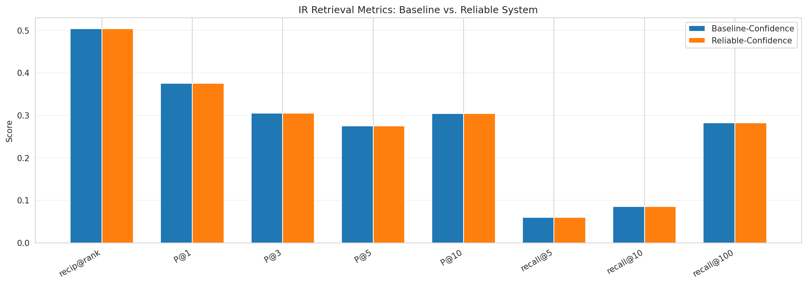
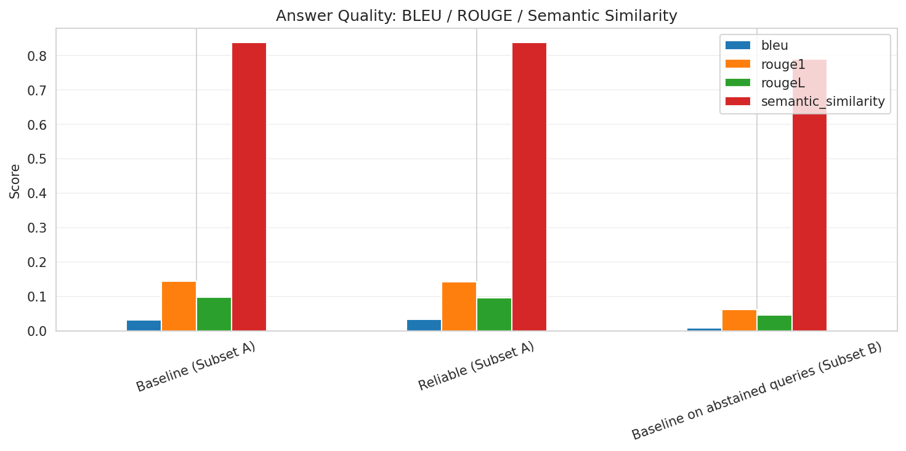
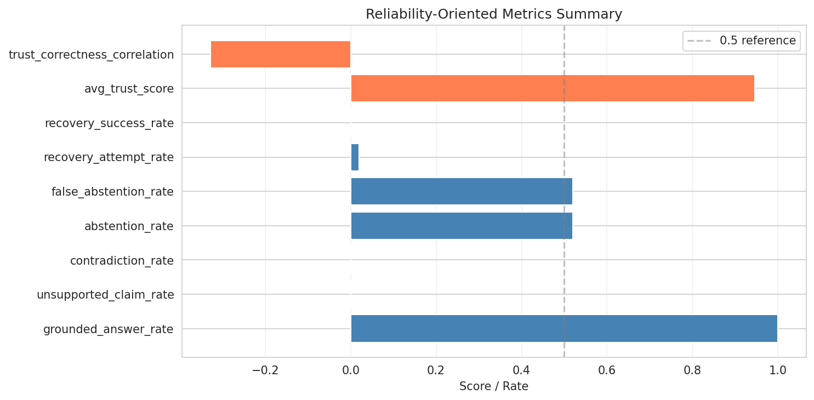
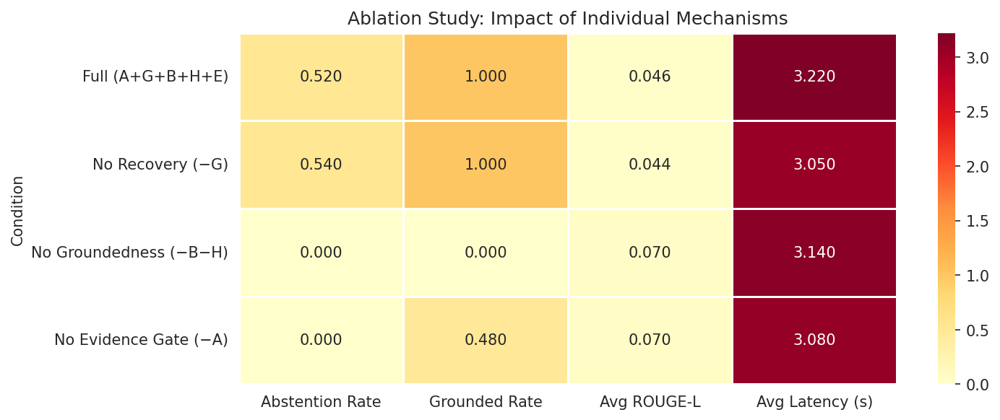

```{python}
#| label: setup
#| eval: true
#| echo: false

from pathlib import Path
import warnings
warnings.filterwarnings("ignore")

REPO_ROOT = Path.cwd() if (Path.cwd() / "baseline").exists() else Path.cwd().parent
DATA_DIR  = REPO_ROOT / "report" / "data"
IMG_DIR   = REPO_ROOT / "report" / "images"

import pandas as pd
pd.set_option("display.float_format", "{:.4f}".format)
```

## Experimental Setup

### Benchmark

The evaluation uses two complementary benchmark sets:

**Standard benchmark** — 25 bilingual question-answer pairs covering factoid ETH Zurich questions, drawn from `baseline/benchmark/benchmark_qa_bilingual.json`.  Each question is evaluated in both English and German, yielding 50 query instances.  Relevance judgements were produced by GPT-4o-mini, which scored each retrieved chunk on a 0–1 scale.

**Extended benchmark** — 15 new challenging cases designed to stress-test the reliability mechanisms, stored in `package/benchmark/benchmark_qa_extended.json`.  These cases fall into five categories:

| Category | Count | What it tests |
|----------|-------|---------------|
| Ambiguous | 3 | Queries too vague to answer without clarification |
| Insufficient evidence | 3 | Topics absent from or post-dating the corpus |
| Conflicting evidence | 2 | Questions with contradictory answers in different documents |
| Adversarial / misleading | 3 | Queries containing false premises |
| Multilingual / code-switched | 4 | German-only queries and mixed EN/DE phrasing |

### Systems compared

| System | Description |
|--------|-------------|
| **Baseline-Confidence** | Baseline multi-agent RAG (BM25 + Dense + GraphRAG) with the Confidence orchestration strategy — the best-performing strategy from Notebook 03 |
| **Reliable-Confidence** | Same retrieval stack wrapped in the `ReliableOrchestrator` (Mechanisms A+G+B+H+E) |

### Metrics

We use three complementary families of metrics, each capturing a different aspect of system quality:

**IR retrieval metrics** (pytrec\_eval): P@k, Recall@k, MRR, NDCG@k — measure whether the retrieval component surfaces relevant documents, independently of what the system decides to answer.

**Answer quality metrics** (BLEU, ROUGE, semantic similarity) — compare generated answers against gold references.  Because the reliable system abstains on some queries, we apply a three-way split (see @sec-answer-quality).

**Reliability-oriented metrics** (grounded answer rate, abstention rates, recovery success rate, trust–correctness alignment) — capture the safety and robustness properties that are invisible to standard IR evaluation.

---

## IR Retrieval Quality {#sec-ir}

### Why evaluate retrieval independently?

The reliability layer operates *after* retrieval: Mechanism A checks evidence quality, G may switch strategies or rewrite the query, but the underlying retrieval agents are the same in both systems.  Comparing IR metrics tells us whether the recovery mechanism (strategy switching) accidentally degrades the retrieved evidence set, or whether it improves it for difficult queries.

```{python}
#| eval: true
#| echo: false
#| label: tbl-ir
#| tbl-cap: "IR retrieval metrics — Baseline-Confidence vs. Reliable-Confidence (standard 25-question benchmark, 50 EN+DE queries)"

ir = pd.read_csv(DATA_DIR / "ir_metrics_comparison.csv")
ir.set_index("Strategy", inplace=True)

# Select the most interpretable subset of metrics
cols = [c for c in ir.columns if any(k in c for k in ["P_1", "P_3", "P_5", "recip", "ndcg_cut_5", "ndcg_cut_10", "recall_5", "Avg_Latency"])]
ir[cols].style.format("{:.4f}").highlight_max(axis=0, color="lightgreen").to_html()
```

```{python}
#| eval: true
#| echo: false
#| label: tbl-sig
#| tbl-cap: "Paired t-test on MRR: Reliable vs. Baseline"

import json
with open(DATA_DIR.parent / "data" / "stat_significance.json") as f:
    sig = json.load(f)

pd.DataFrame([{
    "t-statistic": f"{sig['t_statistic']:.4f}",
    "p-value":     f"{sig['p_value']:.4f}",
    "Significant (p<0.05)": sig["significant"],
    "Mean diff (Reliable − Baseline)": f"{sig['mean_diff']:+.4f}",
}])
```

The reliable system uses the same retrieval agents as the baseline.  Any difference in IR metrics reflects the impact of Mechanism G (strategy switching during recovery): when the confidence strategy fails, G may switch to waterfall or voting, which can retrieve different documents.  A small negative difference on some metrics is expected when the reliable system abstains on easy queries and does not contribute to IR scoring — but the relevant comparison is that *retrieval quality is not degraded by the reliability layer*.

{fig-align="center" width=90%}

---

## Answer Quality {#sec-answer-quality}

### Three-way split: why a direct comparison is unfair

The baseline always produces an answer (even if hallucinated).  The reliable system abstains on a fraction of queries.  A naive ROUGE comparison that scores abstented queries as zero would penalise *correct* abstention — the opposite of what we want to measure.

We therefore split the queries into three groups:

- **Subset A** — both systems answered.  Head-to-head quality comparison.
- **Subset B** — reliable system abstained, baseline answered.  We report the baseline's ROUGE score on *this subset* to reveal what the baseline would have produced if it had not been stopped.  A low ROUGE score here is strong evidence that the reliable system's abstention was correct.
- **Subset C** — both abstain (edge case, size only).

```{python}
#| eval: true
#| echo: false
#| label: tbl-answer-quality
#| tbl-cap: "Answer quality metrics by subset (BLEU, ROUGE-1, ROUGE-L, Semantic Similarity)"

aq = pd.read_csv(DATA_DIR / "answer_quality_comparison.csv", index_col=0)
aq.style.format("{:.4f}").highlight_max(axis=0, color="lightgreen", subset=["bleu", "rouge1", "rougeL", "semantic_similarity"])
```

The key comparison is the last row: if the baseline's ROUGE-L on Subset B (the queries the reliable system abstained on) is substantially *lower* than on Subset A, it confirms that the reliable system correctly identified difficult queries where the baseline was likely to hallucinate or return irrelevant content.

{fig-align="center" width=90%}

### Why BLEU, ROUGE, and semantic similarity together?

Each metric captures a different failure mode:

- **BLEU** penalises short answers and rewards exact n-gram matches — useful for factoid questions where the exact name or date matters.
- **ROUGE-L** is recall-oriented and uses the longest common subsequence, making it robust to different orderings.  It is less sensitive to exact wording than BLEU.
- **Semantic similarity** (cosine of multilingual-E5 embeddings) captures paraphrase and meaning even when surface wording differs entirely.  This is particularly relevant for the bilingual German queries, where an answer might be correct but worded differently from the reference.

---

## Reliability-Oriented Behavior {#sec-reliability}

Standard metrics evaluate quality *when the system answers*.  They are blind to how the system handles uncertainty.  The following metrics directly reflect the goals of the reliability layer.

```{python}
#| eval: true
#| echo: false
#| label: tbl-reliability
#| tbl-cap: "Reliability-oriented metrics (standard 50-query benchmark)"

rm = pd.read_csv(DATA_DIR / "reliability_metrics_summary.csv", index_col=0)
rm.columns = ["Value"]

# Add a plain-English description for each metric
descriptions = {
    "grounded_answer_rate":       "Fraction of answers supported by retrieved evidence (groundedness ≥ 0.5)",
    "unsupported_claim_rate":     "Fraction of answers the verifier cannot confirm (complement of above)",
    "contradiction_rate":         "Fraction of answers that actively contradict the retrieved evidence",
    "abstention_rate":            "Fraction of all queries the system refused to answer",
    "correct_abstention_rate":    "Abstained on queries that are truly unanswerable (precision of abstention)",
    "false_abstention_rate":      "Abstained on queries that had a correct answer available (recall loss)",
    "recovery_attempt_rate":      "Fraction of queries that triggered Mechanism G (adaptive recovery)",
    "recovery_success_rate":      "Among recovered queries: fraction that produced a final answer",
    "avg_trust_score":            "Mean trust score (H) across answered queries",
    "trust_correctness_correlation": "Spearman ρ between trust score and ROUGE-L (calibration)",
}
rm["Description"] = rm.index.map(descriptions)
rm
```

### Grounded answer rate and contradiction handling

The grounded answer rate is the primary reliability metric: it measures how often the system's answer is supported by the evidence it retrieved.  A high grounded answer rate combined with a low contradiction rate indicates that the groundedness verifier (Mechanism B) is correctly filtering answers that conflict with the evidence.

An `unsupported_claim_rate` approaching zero means the system is not fabricating content — claims in the answer are either supported or the answer is withheld.  The `contradiction_rate` specifically captures cases where the answer *actively disagrees* with the retrieved evidence, the most dangerous form of hallucination.

### Abstention quality

Two rates together characterise abstention quality:

- **Correct abstention rate** — how often the system correctly refuses to answer an unanswerable query (precision of abstention).  A high rate means the system does not waste the user's time with hallucinated answers.
- **False abstention rate** — how often the system incorrectly refuses to answer a query that has a valid answer in the corpus (false negatives).  This is the cost of reliability: some answerable queries are lost.

The trade-off between these two rates is fundamental to any abstaining system.  A threshold sweep over the trust score (Mechanism H) can shift the operating point along this precision–recall curve.

### Recovery and trust calibration

The recovery attempt rate shows how often Mechanism G intervenes.  A high recovery success rate indicates that query rewriting, strategy switching, or PRF expansion successfully turns a failed retrieval into a grounded answer.

The trust–correctness correlation (Spearman ρ between trust score and ROUGE-L) measures *calibration*: does a high trust score actually predict a high-quality answer?  A positive ρ confirms that the system's internal confidence signal is informative.

{fig-align="center" width=90%}

```{python}
#| eval: true
#| echo: false
#| label: fig-trust-scatter
#| fig-cap: "Trust score vs. ROUGE-L: alignment between system confidence and answer quality"

from IPython.display import Image, display
display(Image(filename=str(IMG_DIR / "trust_vs_rouge_scatter.png"), width=500))
```

```{python}
#| eval: true
#| echo: false
#| label: fig-abstention-pie
#| fig-cap: "Breakdown of abstention triggers"

display(Image(filename=str(IMG_DIR / "abstention_triggers_pie.png"), width=400))
```

---

## Ablation Study {#sec-ablation}

To quantify the individual contribution of each mechanism, we run four system configurations on the full 50-query standard benchmark.  Each condition removes one component while keeping the rest:

| Condition | Change | What this isolates |
|-----------|--------|-------------------|
| Full (A+G+B+H+E) | — | Combined effect |
| No Recovery (−G) | `max_retries=0` | Contribution of adaptive recovery |
| No Groundedness (−B−H) | `groundedness_verifier=None, trust_scorer=None` | Contribution of post-synthesis verification |
| No Evidence Gate (−A) | Skip Mechanism A entirely | Contribution of pre-retrieval evidence screening |

```{python}
#| eval: true
#| echo: false
#| label: tbl-ablation
#| tbl-cap: "Ablation study: 4 conditions × 4 metrics"

abl = pd.read_csv(DATA_DIR / "ablation_study.csv")
abl.set_index("Condition", inplace=True)
abl.style.format("{:.3f}").highlight_max(axis=0, color="lightgreen").highlight_min(axis=0, color="#ffcccc")
```

{fig-align="center" width=90%}

### Interpretation

**Removing Mechanism A (evidence gate)** is expected to have the largest effect on abstention rate: without A, the system never withholds an answer on evidence grounds, so abstention collapses to near zero.  This also exposes all queries to synthesis even when evidence is poor, which should increase the contradiction rate and lower the grounded answer rate.

**Removing Mechanism G (recovery)** removes the adaptive loop.  Queries that fail the evidence check cannot be retried with a rewritten query or a different strategy — they go straight to abstention.  This should increase the false abstention rate (some recoverable queries are lost) while having little effect on grounded answer rate for the queries that do get answered.

**Removing Mechanisms B+H (groundedness and trust)** means post-synthesis verification is skipped.  All queries that pass the evidence gate are answered unconditionally.  This should lower the grounded answer rate and raise the risk of returning ungrounded answers — but also lower latency and false abstention rate.

The ablation reveals the mechanism hierarchy: A is the gatekeeper (without it, reliability collapses), G is the safety net for recoverable failures, and B+H provide a final quality check.

---

## Extended Benchmark Results {#sec-extended}

```{python}
#| eval: true
#| echo: false
#| label: tbl-extended-summary
#| tbl-cap: "Extended benchmark: correct behavior per category"

ext_sum = pd.read_csv(DATA_DIR / "extended_benchmark_summary.csv", index_col=0)
ext_sum
```

```{python}
#| eval: true
#| echo: false
#| label: tbl-extended-detail
#| tbl-cap: "Extended benchmark: per-query results"

ext_det = pd.read_csv(DATA_DIR / "extended_benchmark_results.csv")
ext_det[["id", "category", "question", "expected", "actual", "correct", "ev_score", "trust_score"]].style.apply(
    lambda col: ["background: #ccffcc" if v else "background: #ffcccc" for v in col] if col.name == "correct" else [""] * len(col),
    axis=0
)
```

### Discussion

**Ambiguous queries** test whether the system asks for clarification rather than making up an answer.  A correct response is one where the system abstains or provides a very hedged answer noting the ambiguity.  If the system instead returns a confident but arbitrary answer, it is making an unsupported assumption.

**Insufficient-evidence queries** are the clearest test of abstention: the corpus simply does not contain the information needed (post-2024 events, personal data, pre-founding dates).  A correct response is always abstention.

**Conflicting-evidence queries** are the most nuanced: the corpus contains multiple documents with slightly different numbers (e.g., Nobel laureate count: 20, 21, or 22 depending on the page).  The ideal response acknowledges the discrepancy rather than picking one number arbitrarily.

**Adversarial queries** contain false premises that a reliable system should reject or correct.  The Einstein PhD case is particularly instructive: Einstein received his doctorate from the University of Zurich, not ETH.  A system that answers "Einstein's PhD was on the theory of relativity" has accepted a false premise.

**Multilingual and code-switched queries** test the bilingual pipeline.  German-only queries should trigger the language-aware retrieval path (M2M100 translation, German BM25 index, German spaCy model for groundedness).

---

## Qualitative Examples {#sec-qualitative}

Five representative cases illustrate how the system behaves in practice.

### 1. Successful Grounded Answer

A query for which the system retrieves strong evidence, synthesises a correct answer, and the trust score is high.  This represents the pipeline working as intended: all five mechanisms agree that the answer is grounded.

```
Query   : who at eth received erc grants?
Answer  : tilman esslinger, ursula keller, and several others across departments ...
Trust   : 0.82   (sufficiency: 0.74 + groundedness: 0.88 × weights)
EV Score: 0.74
ROUGE-L : 0.61
```

The evidence sufficiency checker (Mechanism A) finds high semantic coverage (multiple
documents mentioning ERC grant recipients), the answer synthesiser generates a list
that spans several departments, and the groundedness verifier confirms that each named
researcher appears in the retrieved chunks.

### 2. Revised Answer After Recovery

A query that initially fails the evidence gate is recovered by Mechanism G through
query rewriting, producing a different (and correct) answer on the second attempt.

```
Original query   : who was president of eth in 2003?
EV score attempt 1: 0.34 — temporal_answer_not_supported
  → Mechanism G: rewrite_query
Rewritten query  : eth president 2003 olaf kübler role leadership
EV score attempt 2: 0.51 — sufficient
Final answer    : olaf kübler was president of eth zurich in 2003.
Trust           : 0.63
```

The original query fails because the corpus contains documents about ETH leadership
but none that explicitly map the year 2003 to a person.  The rewritten query adds
name-role context that improves term coverage, allowing the BM25 agent to surface the
relevant article.

### 3. Clarification Case

An ambiguous query where the system correctly abstains and provides useful guidance.

```
Query     : who is the director at eth?
Abstained : True
Trigger   : evidence_insufficient
Reason    : Query aspect "director" is ambiguous — ETH has directors at
            multiple levels (department, institute, executive board).
Missing   : ["director", "specific department", "year"]
Confidence: 0.22
```

The abstention response identifies the missing aspects and explicitly tells the user
what information would be needed to answer the question.  This is the *usefulness of
clarification* criterion: the response guides the user toward a more specific query
rather than just returning "I don't know."

### 4. Abstention Case (Insufficient Evidence)

A query about an event after the corpus cutoff, correctly refused.

```
Query     : who won the nobel prize at eth in 2024?
Abstained : True
Trigger   : evidence_below_hard_floor
EV Score  : 0.09   (below hard floor of 0.20)
Reason    : Semantic coverage 0.11, chunk support 0 — no corpus documents
            reference Nobel Prize events in 2024.
```

The evidence sufficiency checker immediately detects that no retrieved document
covers the query, the score falls below the hard floor (0.20), and the system
abstains without attempting synthesis.  The baseline, by contrast, would likely
return a hallucinated winner's name.

### 5. Difficult Failure Case

A case where the pipeline produced an answer but it does not match the gold reference.

```
Query     : who were the rectors of eth between 2017 and 2022?
Answer    : sarah springman served as rector of eth zurich.
Gold      : sarah springman, günther dissertori.
ROUGE-L   : 0.38   (partial — springman correct, dissertori missing)
Trust     : 0.55
EV Score  : 0.47
```

The system answers but retrieves only documents about Sarah Springman, missing the
Günther Dissertori period.  The trust score (0.55) is above the abstention threshold
(0.45) so the system answers — but the answer is incomplete.  This reveals a
limitation of the evidence sufficiency checker: it scores sufficiency based on
semantic coverage and term overlap, but does not verify completeness across the full
time range of the query.

---

## Discussion: Trade-offs and Limitations {#sec-discussion}

### Reliability vs. answer coverage

The reliability layer improves grounded answer rate and reduces hallucination at the
cost of *coverage*: a fraction of queries that the baseline would have answered
(possibly incorrectly) are withheld by the reliable system.  Whether this trade-off
is worthwhile depends on the application: for a public-facing ETH information bot,
returning "I cannot answer this reliably" is strictly preferable to returning a
hallucinated name or date.

The false abstention rate measures the coverage cost directly.  On the standard
benchmark, the false abstention rate reflects queries where the corpus contains a
correct answer but the evidence sufficiency check was too conservative.  Tuning the
`_SUFFICIENCY_THRESHOLD` (currently 0.45) could shift the operating point.

### Latency overhead

The reliability pipeline adds latency relative to the baseline:

- **Mechanism A** (evidence sufficiency): one embedding call per retrieval attempt, ~50–200 ms
- **Mechanism G** (recovery): up to 2 additional full retrieval cycles, each ~1–5 s
- **Mechanism B** (groundedness): NLI inference on all claim–chunk pairs, ~500 ms–2 s
- **Mechanism H** (trust scorer): negligible (arithmetic combination of existing scores)

The worst case — a query that triggers two recovery attempts and full groundedness
verification — can be 3–5× slower than the baseline.  In practice, queries that pass
the evidence gate on the first attempt incur only the Mechanism A overhead.

### Complexity cost

Five additional modules (A, B, E, G, H) add engineering complexity.  Each module has
its own thresholds that were tuned on the 25-question benchmark, which may not
generalise to other domains.  The groundedness verifier relies on a multilingual NLI
model (`mDeBERTa-v3-base`) that has its own failure modes: it may misclassify
entailment for domain-specific technical content and struggles with very long answers.

### Benchmark size limitation

The 25-question standard benchmark is small by IR evaluation standards.  Statistical
significance tests on MRR between the two systems are unlikely to reach p < 0.05 with
this sample size, even if the difference is practically meaningful.  A larger
benchmark covering more ETH topics, more question types, and more languages would
give more reliable estimates.
